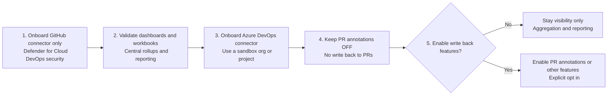

# GitHub + Azure DevOps - Overview   Art of the Possible 

Costa Rica

 [brown9804](https://github.com/brown9804)

Last updated: 2026-03-13

----------------------

<b>List of References </b> (Click to expand)

  
- [Visual Studio subscriptions pricing](https://visualstudio.microsoft.com/vs/pricing/?tab=paid-subscriptions)
- [GitHub Enterprise Pricing](https://github.com/pricing)
- [GitHub Advanced Security license billing](https://docs.github.com/en/billing/concepts/product-billing/github-advanced-security)
- [GitHub Actions billing](https://docs.github.com/en/billing/concepts/product-billing/github-actions)
- [GitHub Code Quality billing](https://docs.github.com/en/billing/concepts/product-billing/github-code-quality)
- [Pricing for Azure DevOps](https://azure.microsoft.com/en-us/pricing/details/devops/azure-devops-services/?msockid=38ec3806873362243e122ce086486339)
- [GitHub pricing options](https://azure.microsoft.com/en-us/pricing/details/githubenterprise/?msockid=38ec3806873362243e122ce086486339)
- [What is GitHub Advanced Security integration with Microsoft Defender for Cloud (preview)?](https://learn.microsoft.com/en-us/azure/defender-for-cloud/github-advanced-security-overview)
- [Setup GitHub Advanced Security native integration with Microsoft Defender for Cloud](https://learn.microsoft.com/en-us/azure/defender-for-cloud/github-advanced-security-deploy)

<b>Table of Content </b> (Click to expand)

- [Why GitHub?](#why-github)
- [Why GitHub Copilot?](#why-github-copilot)
- [Why Azure DevOps & GitHub](#why-azure-devops--github)
- [GHAS in GitHub Repos vs Azure DevOps Repos](#ghas-in-github-repos-vs-azure-devops-repos)
- [More secure with Defender for Cloud](#more-secure-with-defender-for-cloud)
- [FAQ](@faq)

> [!NOTE]
> - Visual Studio `Dev Platform`
> - Azure DevOps `Boards + Pipelines`
> - GitHub areas: `Code Platform`
>   - GitHub Enterprise Cloud
>   - GitHub Enterprise Server
>   - GitHub Advanced Security (Code Scanning, Secret Scanning)
>   - GitHub Copilot For Business
>   - GitHub Copilot for Enterprise
>   - GitHub Actions
>   - GitHub Code Quality (coming soon) 

  

## Why GitHub?

> GitHub isn’t just a place to store code, it’s a social network for developers, a productivity engine, and a secure ecosystem that powers everything from hobby projects to the world’s largest enterprises. `Over 150 million developers use GitHub, making it the largest coding community in the world.` Click here to see real time insights [The developers metric represents the number of developer accounts on GitHub in a given economy. This count excludes users that are bots or otherwise flagged as “spammy” within internal systems. See our documentation for personal accounts for more information](https://innovationgraph.github.com/global-metrics/developers)

| Category                  | Details |
|---------------------------|---------|
| **Community & Collaboration** | - Largest developer hub with **100M+ users**, making it the default platform for open-source and enterprise projects. - Built-in collaboration tools: issues for bug tracking, pull requests for code review, and discussions for knowledge sharing. - Hosts the world’s most influential open-source projects (React, TensorFlow, Kubernetes), ensuring developers can contribute to or learn from cutting-edge codebases. - Social coding features (stars, forks, followers) encourage discovery and networking among developers. |
| **Version Control**       | - Powered by **Git**, the industry-standard version control system trusted by developers worldwide. - Transparent history of every commit, enabling accountability and easy debugging. - Branching and merging workflows support agile development, experimentation, and safe rollbacks. - Advanced features like protected branches and required reviews enforce quality standards in teams. |
| **Integration & Ecosystem** | - **GitHub Copilot**: AI-powered coding assistant integrated directly into GitHub and IDEs like VS Code and JetBrains. - **GitHub Actions**: Automates CI/CD pipelines, testing, deployments, and workflows without leaving the repository. - **GitHub Codespaces**: Cloud-based development environments that spin up instantly, reducing setup time. - Rich ecosystem of integrations with tools like Slack, Jira, AWS, Azure, VS Code, Docker, and more, making GitHub the central hub of modern software development. |
| **Security & Compliance** | - **Dependabot**: Automatically scans and updates vulnerable dependencies to keep projects secure. - **Code scanning & secret detection**: Identifies flaws and exposed credentials before they reach production. - Enterprise-grade compliance features (SOC 2, ISO certifications) make GitHub suitable for regulated industries. - Security advisories and vulnerability databases help teams stay ahead of risks. |
| **Developer Experience**  | - Beginner-friendly interface with intuitive repo management, making GitHub accessible to new developers. - Built-in documentation tools (README files, wikis) and knowledge sharing features streamline onboarding. - **Project boards** and task management tools support agile workflows directly inside GitHub. - **GitHub Pages**: Free static site hosting from repositories, ideal for documentation, portfolios, or project websites. - Rich search and code navigation features (code search, blame view) improve productivity and understanding of large codebases. |

https://github.com/user-attachments/assets/72e3efd7-07c8-4677-bbfe-ae2cfe73a459

## Why GitHub Copilot?

> GitHub Copilot stands out because it’s deeply integrated into the developer workflow, trained on massive open-source codebases, and optimized for real-time coding assistance inside IDEs like VS Code and JetBrains. Unlike many competitors, it’s designed as a `pair programmer` that not only autocompletes but also explains, suggests, and adapts to your coding style.

| Category                  | Details |
|---------------------------|---------|
| **Integration & Ecosystem** | - Native integration with GitHub & VS Code (embedded directly into IDEs) - Seamless GitHub workflow (repositories, pull requests, GitHub Actions) |
| **Training Data & Accuracy** | - Trained on billions of lines of open-source code - Provides contextually relevant suggestions across languages/frameworks - Adaptive learning that improves with your coding style & project context |
| **Productivity Gains**    | - Developers report **30–40% faster coding** compared to manual coding - Reduces boilerplate and repetitive tasks - Frees time for higher-level problem solving |
| **Unique Features**       | - **Copilot Chat**: natural language queries, debugging, explanations - **Context awareness**: reads surrounding code for accurate completions - **Multi-language support**: strong across Python, JavaScript, TypeScript, Go, C#, and more |

https://github.com/user-attachments/assets/e0973d9a-73ab-4c67-a7c4-e7418c73c67f

## Why Azure DevOps \& GitHub 

`Use GitHub to optimize developer productivity and Azure DevOps to enforce enterprise governance and delivery controls, together they give us speed and safety.`

> They’re **better together** because each platform is strongest where the other is "complex".
> - **Azure DevOps = operations, governance, and planning**
> - **GitHub = developer experience and collaboration**  

How they complement each other: 

| Focus Area                | Azure DevOps Strength                            | GitHub Strength                             |
| ------------------------- | ------------------------------------------------ | ------------------------------------------- |
| Governance & Control      | ✅ Enterprise policies, approvals, RBAC, audits   | ⚠️ Lighter governance                       |
| Planning & Tracking       | ✅ Structured Boards (Epics → Features → Stories) | ⚠️ More flexible, less prescriptive         |
| Compliance & Traceability | ✅ End‑to‑end traceability                        | ⚠️ Requires more setup                      |
| Developer Experience      | ⚠️ Functional but heavier                        | ✅ Best‑in‑class UX                          |
| Code Collaboration        | ⚠️ Solid but utilitarian                         | ✅ Industry‑leading PRs & reviews            |
| Ecosystem                 | ⚠️ Microsoft‑centric                             | ✅ Massive global ecosystem                  |
| Security in Code          | ⚠️ External integrations                         | ✅ Native GHAS (CodeQL, Dependabot, secrets) |

> Why they’re better together (the “division of labor”)

**Azure DevOps handles:**

*   Portfolio planning and roadmaps
*   Enterprise governance and compliance
*   Release management and approvals
*   Cross‑team visibility and reporting

**GitHub handles:**

*   Day‑to‑day developer workflows
*   Pull requests and code reviews
*   InnerSource / Open Source collaboration
*   Modern CI with GitHub Actions
*   Shift‑left security (GHAS)

> A very common enterprise pattern:

  

  *   **Developers** a fast, familiar, low‑friction experience
  *   **Platform / Ops / Security** teams the controls they need
  *   **Leadership** visibility, traceability, and compliance

## GHAS in GitHub Repos vs Azure DevOps Repos

> The main difference is that `GitHub Advanced Security (GHAS) is natively integrated into GitHub repositories`, while in `Azure DevOps it is available only through an extension` and with limited functionality in some aspects (Azure DevOps repos require setup and don’t support all GitHub-native workflows). Click here [Key differences between Azure DevOps and GitHub](https://docs.github.com/en/migrations/ado/key-differences-between-azure-devops-and-github?utm_source=copilot.com) to read more about it.

> [!TIP]
> Azure DevOps is stronger in project management and pipelines, but GitHub is stronger in developer-centric workflows and security integration. GitHub repos give you the complete GHAS package with minimal friction, while Azure DevOps repos provide only a subset of GHAS features and require more setup effort.
> - **GitHub repos** → Full GHAS experience: seamless integration, developer-first workflows, dependency review, Dependabot, and inline alerts.  
> - **Azure DevOps repos** → Limited GHAS: code scanning and secret scanning are available, but dependency review and Dependabot are missing. Setup is required, and alerts aren’t as tightly integrated into developer workflows.

| Dimension | GitHub Repos (Native GHAS) | Azure DevOps Repos (GHAS Extension) |
|-----------|-----------------------------|--------------------------------------|
| **Integration Model** | Fully native, built into GitHub platform | Delivered via Azure DevOps extension; requires installation and configuration |
| **Code Scanning** | Native integration with GitHub Actions; alerts appear directly in PRs/issues | Supported via Azure Pipelines; requires pipeline setup; alerts less seamlessly integrated |
| **Secret Scanning** | Automatic detection of secrets in commits, PRs, and historical code; alerts in repo UI | Supported, but requires configuration; alerts surfaced differently, not as tightly bound to PR workflow |
| **Dependency Review** | Built-in; shows dependency changes in PRs with risk insights | Not available in Azure DevOps |
| **Dependency Scanning (Dependabot)** | Native Dependabot alerts and updates | Not supported; requires external tooling |
| **UI/Developer Experience** | Security alerts visible directly in GitHub repo interface and PRs | Alerts managed via Azure DevOps project dashboards; less developer-centric |
| **Remediation Workflow** | Inline in PRs; developers can fix issues before merging | Issues raised in pipelines; remediation requires manual tracking |
| **Setup Effort** | Minimal; enable features in repo settings | Higher; requires extension installation and pipeline configuration |
| **Ecosystem Fit** | Best for teams already using GitHub for collaboration and CI/CD | Best for enterprises tied to Azure DevOps boards/pipelines |
| **Feature Coverage** | Full GHAS suite: code scanning, secret scanning, dependency review, Dependabot | Partial GHAS suite: code scanning + secret scanning; dependency review and Dependabot missing |
| **Policy & Governance** | GitHub org-level policies; security alerts aggregated across repos | Azure DevOps org/project-level management; less granular integration |
| **Cost Model** | GHAS is a paid add-on for GitHub Enterprise | GHAS extension is licensed separately for Azure DevOps |

## More secure with Defender for Cloud 

Click here to read more about [What is GitHub Advanced Security integration with Microsoft Defender for Cloud (preview)?](https://learn.microsoft.com/en-us/azure/defender-for-cloud/github-advanced-security-overview), and [Setup GitHub Advanced Security native integration with Microsoft Defender for Cloud](https://learn.microsoft.com/en-us/azure/defender-for-cloud/github-advanced-security-deploy)

> [!NOTE]
> - If you already have GHAS enabled and producing findings, Defender doesn’t replace GHAS scanning. It aggregates and operationalizes those results across repos/orgs, and adds DevOps posture signals and optional PR annotations.
> - The “central dashboard for GHAS findings” you heard about is not a GitHub UI feature. It’s the DevOps security experience inside Microsoft Defender for Cloud (Azure portal).
>   - In practice, this means your repo-level GHAS signals (CodeQL/code scanning, secret scanning, dependency scanning/Dependabot) can be aggregated and reported at an org/project level in Defender for Cloud (across many repos), alongside DevOps posture/security recommendations.
>   - To make that work, Defender for Cloud must be able to “see” those results, which requires you to onboard (connect) your GitHub organization and/or Azure DevOps organization to Defender for Cloud using a DevOps security connector. That connector is an Azure-side configuration that establishes authorization between Azure and GitHub/ADO so Defender can inventory repos/projects and pull in security findings for centralized visibility (and, if you later choose to enable it, optional features like PR annotations).

> Coverage areas across SAST, dependency scanning, and code security signals: 

| Coverage area | Typical signals included | GHAS (GitHub Advanced Security) coverage | Microsoft Defender for Cloud – DevOps security coverage |
|---|---|---|---|
| **SAST (Code scanning / CodeQL)** | Static code vulnerabilities, insecure patterns, taint-flow issues, CWEs (language dependent) | Runs CodeQL/code scanning and creates repo-level code scanning alerts | Surfaces/rolls up code scanning findings across connected GitHub orgs / ADO orgs for centralized reporting |
| **Dependency scanning (SCA)** | Vulnerable OSS packages + transitive deps (CVEs/advisories), dependency risk signals | Dependabot/dependency alerts (and optionally update PRs if configured) | Surfaces/rolls up dependency vulnerability scanning findings across onboarded repos/projects |
| **Secret scanning** | Detected secrets in commits/history; optional push protection signals | Secret scanning alerts + push protection (if enabled) | Aggregated visibility of secret-related findings across connected DevOps environments |
| **Code security “signals” (coverage/status)** | Whether scanning is enabled, gaps (code scanning off, secret scanning off, dependency scanning off), counts by severity/type | Strong at per-repo enablement and alert detail | Strong at org/project-level inventory + “advanced security status” and findings counts across many repos |

> Developer experience and operational workflow (alerts, triage, remediation): `You can start **visibility-first**: connect for aggregation/reporting, keep write-back features (like PR annotations) off until you choose to enable them.`

- **Where alerts show up**
  - **GHAS**: Alerts live in the repo (Security tab) and in PR checks/code scanning results; devs see issues in the same place they code/review.
  - **Defender (DevOps security)**: Alerts/findings are surfaced in the Azure portal as a centralized view across many repos/orgs/projects.
- **How triage typically happens**
  - **Developers** triage primarily in **GHAS** (closest to code owners, PR context, blame/history, and fix workflow).
  - **Security/DevSecOps** triage at scale in **Defender** to spot hotspots (which orgs/projects/repos have most high severity, which repos have scanning disabled, trends).
- **How remediation gets driven**
  - **GHAS**: Remediation is PR-centric (fix code, update dependencies, rotate/revoke secrets). This is where the “do the work” loop happens.
  - **Defender**: Typically drives **governance + prioritization** (visibility, reporting, assignment follow-up) rather than directly fixing code.
- **Optional “feedback into PRs”**
  - **Defender** can be configured to add **PR annotations** (comments/annotations) so devs see security findings directly in PR diffs.
  - This is **explicitly enabled/configured** (not something Defender does automatically just by being connected), and it’s a key reason connectors may request broader permissions.

> Visibility and reporting at an organization or project level (vs. individual repositories):

> [!IMPORTANT]
> E.g: Assuming your setup is
> - GHAS enabled on at least one **GitHub org/repo**
> - GHAzDO (GitHub Advanced Security for Azure DevOps) enabled on at least one **Azure DevOps repo**
> - You’re evaluating **Defender for Cloud → DevOps security** as the cross-org dashboard

> - The **central dashboard effect only happens after onboarding connectors** (GitHub and/or ADO) to Defender for Cloud.
> - You can onboard **GitHub first** to validate the “dashboard value” with lower operational concern, then onboard ADO later.
> - “Write-back” style behavior (example: PR annotations) is an **optional feature you explicitly enable**, not the default requirement for basic aggregation/reporting.

| Scenario | What shows up for GitHub repos | What shows up for Azure DevOps repos (GHAzDO) | “Org / project level” reporting outcome |
|---|---|---|---|
| **GHAS only (GitHub)** | Full repo-level GHAS views (code scanning, secrets, dependency alerts) in GitHub | Nothing (unless you also enabled GHAzDO separately in ADO) | Mostly **per-repo**; org-wide visibility depends on GitHub’s own org reporting and exports |
| **GHAzDO only (Azure DevOps)** | Nothing | Repo-level Advanced Security views in ADO (CodeQL/code scanning, dependency, secrets depending on what’s enabled) | Mostly **per-project/per-repo** inside ADO; not a unified view across GitHub + ADO |
| **Defender DevOps security + GitHub connector (GitHub onboarded)** | Defender shows centralized inventory + rollups for onboarded GitHub repos (findings counts, status) | Nothing for ADO until you also onboard ADO | **Org-level for GitHub** (good “single pane” across GitHub repos) but not across ADO |
| **Defender DevOps security + ADO connector (ADO onboarded)** | Nothing for GitHub until you also onboard GitHub | Defender shows centralized inventory + rollups for ADO repos/projects (including GHAzDO-derived signals where applicable) | **Project/org-level for ADO** (good rollup across ADO projects/repos) but not across GitHub |
| **Defender DevOps security + both connectors (GitHub + ADO onboarded)** | Centralized rollups for GitHub GHAS results | Centralized rollups for ADO (including GHAzDO) | This is the “central dashboard” outcome: **one Azure place** to view posture/findings across **both platforms**, filter by org/project/repo, severity, finding type |

## FAQ

1. **Is there any way to preview/understand Defender’s GHAS-related dashboards before granting ADO write permissions?**
      > - You can **preview the UX conceptually** via Microsoft Learn pages/screenshots (DevOps security blade + workbook), but there isn’t a true “your data” preview without onboarding a connector.
      > - A practical low-risk preview approach is **GitHub-first onboarding**: connect only your GitHub org to Defender for Cloud DevOps security first (no ADO connector yet). That lets you see the *actual* Defender DevOps security inventory/rollups and how GHAS findings appear in Defender, without granting any permissions to Azure DevOps.
      > - Microsoft references a **DevOps Security workbook** and the DevOps security “Manage your DevOps environments” experience in Defender for Cloud (these show the layout: inventory, advanced security status, findings rollups, filters).
2. **Once Defender is enabled with the required permissions, does it automatically take action in ADO (write-back / issues / config changes)?**
      >  - Defender for Cloud DevOps security will **perform discovery and scanning/assessment activities** after connection (it calls DevOps APIs and can run recurring posture scans). That’s “activity,” but not the same as “writing back.”
      >  - **Write-back behaviors are feature-driven and require explicit enablement/configuration.** The clearest example is **Pull Request annotations**: Microsoft documents that PR annotations are something you **turn on** in Defender for Cloud (and optionally scope by category/severity). Those annotations are effectively a “write” action into PRs.
      >  - Microsoft also explicitly explains that the reason ADO connector asks for **write permissions** (work items/build/code/service hooks/advanced security) is because those permissions are needed for **certain features such as PR annotations**, not because Defender will automatically start changing your ADO configuration the moment it’s connected.
3. **Can Defender be configured “read-only” / visibility-first (aggregation + reporting only) at the start?** `
    > - **Yes in practice**, with two layers of control:
    >     1. **Azure-side access**: you can grant your security viewers **Security Reader** scoped to the connector/resource group so they can view findings without broad subscription write privileges.
    >     2. **Feature enablement**: connect the DevOps environment for visibility, but **do not enable PR annotations** (and avoid installing/enabling any optional pipeline/action components until you’re ready). In this mode, Defender functions as an **aggregation and reporting console**.
    >  - Caveat: the connector authorization itself may still request broader ADO scopes than you’d like, even if you intend to run visibility-only. That’s a governance decision about what the connector *could* do vs what you actually enable.

> [!TIP]
> A safe “visibility-first” pilot is:
> - (1) onboard the GitHub connector only
> - (2) validate Defender for Cloud DevOps security dashboards/workbooks
> - (3) onboard the Azure DevOps connector in a sandbox org/project
> - (4) keep PR annotations OFF (no write-back)
> - (5) only then decide whether to enable any write-back features (like PR annotations) based on governance comfort.

<!-- START BADGE -->

  
  
Refresh Date: 2026-01-25

<!-- END BADGE -->
