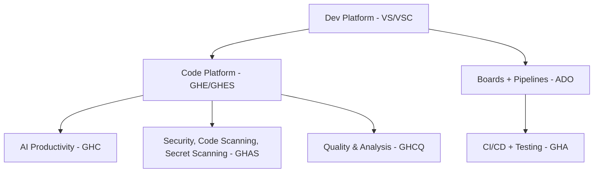

# Minimum Access Requirements   for CI/CD Pipelines - Overview

Costa Rica

 [brown9804](https://github.com/brown9804)

Last updated: 2026-01-25

----------------------

> One of best practices is `starting with the built-in Contributor role as a template`,
> then `subtract what isn’t needed and add what Contributor misses.`
> Microsoft provides tools to fetch a role definition. For example, [you can get the JSON for Contributor and modify it](https://learn.microsoft.com/en-us/azure/role-based-access-control/custom-roles).
> In practice, you might create two roles for pipelines: one `“Deployment Contributor”` that has all [resource actions](https://learn.microsoft.com/en-us/azure/role-based-access-control/resource-provider-operations) `(like
> Contributor minus RBAC),` and another `“Access Manager”` role with `just Microsoft.Authorization/roleAssignments/*`

<b>List of References </b> (Click to expand)

- [Azure roles, Microsoft Entra roles, and classic subscription administrator roles](https://learn.microsoft.com/en-us/azure/role-based-access-control/rbac-and-directory-admin-roles)

    

- [Azure permissions](https://learn.microsoft.com/en-us/azure/role-based-access-control/resource-provider-operations)
- [Azure custom roles](https://learn.microsoft.com/en-us/azure/role-based-access-control/custom-roles)
- [Tutorial: Create an Azure custom role using Azure CLI](https://learn.microsoft.com/en-us/azure/role-based-access-control/tutorial-custom-role-cli)
- [About pipeline security roles](https://learn.microsoft.com/en-us/azure/devops/organizations/security/about-security-roles?view=azure-devops)
- [Manage security in Azure Pipelines](https://learn.microsoft.com/en-us/azure/devops/pipelines/policies/permissions?view=azure-devops)
- [Secure your Azure Pipelines](https://learn.microsoft.com/en-us/azure/devops/pipelines/security/overview?toc=%2Fazure%2Fdevops%2Forganizations%2Fsecurity%2Ftoc.json&view=azure-devops)

> For example: How linking from Resource Manager and CI/CD to Microsoft Entra ID is the key to having an end-to-end governance model.

> [!NOTE]
> Azure DevOps repos / GitHub repos:

From [End-to-end governance in Azure when using CI/CD](https://learn.microsoft.com/en-us/devops/operate/governance-cicd)

<!-- START BADGE -->

  
  
Refresh Date: 2026-01-25

<!-- END BADGE -->
