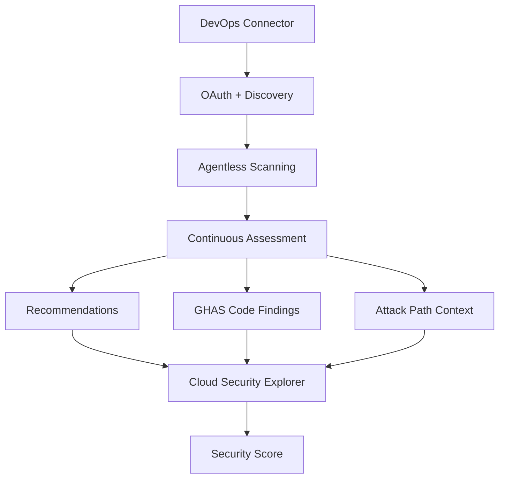

# Microsoft Defender for Cloud DevOps security - Overview 

Costa Rica

 [brown9804](https://github.com/brown9804)

Last updated: 2026-03-19

----------------------

> **Microsoft Defender for Cloud DevOps security** (also called **Defender for DevOps**) extends Defender for Cloud **earlier into the software development lifecycle (SDLC)**. `It gives security teams visibility and control over DevOps risk, not just deployed workloads`. Extends cloud security into source code and pipelines, giving security teams centralized visibility and risk prioritization across GitHub and Azure DevOps, especially when paired with GitHub Advanced Security for deep code analysis. It is:
> - A **security control plane** for DevOps environments
> - A **bridge between application security and cloud security**

`What it is, what it protects, how it works, and where it fits relative to GHAS and Azure DevOps.`

<b>List of References </b> (Click to expand)

- [Overview of Microsoft Defender for Cloud DevOps security](https://learn.microsoft.com/en-us/azure/defender-for-cloud/defender-for-devops-introduction)
- [Configure GitHub Advanced Security for Azure DevOps](https://learn.microsoft.com/en-us/azure/devops/repos/security/configure-github-advanced-security-features?view=azure-devops&tabs=yaml&pivots=standalone-ghazdo#set-up-dependency-scanning)
- [Connect Azure DevOps environments to Defender for Cloud](https://learn.microsoft.com/en-us/azure/defender-for-cloud/quickstart-onboard-devops)

> [!IMPORTANT]
> Instead of only protecting *runtime* cloud resources, it:
> - Connects to **source control and CI/CD platforms**
> - Continuously **assesses security risks in code, pipelines, and configurations**
> - Surfaces findings in **Microsoft Defender for Cloud** as first‑class security recommendations and alerts

## What DevOps platforms does it support?

> You connect these platforms via **DevOps security connectors** created inside Defender for Cloud. 

Defender for DevOps integrates natively with:
- **Azure DevOps (ADO)** 
- **GitHub**
- **GitHub Advanced Security** → deeper integration for code findings
- **GitLab** 

> [!TIP]
> Emphasizes in **closing the Dev–Sec gap**:
> | Traditional issue                          | How Defender for DevOps helps                |
> | ------------------------------------------ | -------------------------------------------- |
> | Security only sees issues after deployment | Detects risks before code reaches production |
> | Security tools live outside dev workflows  | Integrates with GitHub / ADO natively        |
> | Too many low‑signal findings               | Contextual prioritization via CSPM           |
> | No ownership clarity                       | Repo, branch, PR, and pipeline attribution   |

## What does Defender for DevOps actually scan?

`All findings appear as recommendations in Defender for Cloud, contributing to your secure score`

> Once connected, Defender for DevOps continuously evaluates for example:

| Area | Key Focus Areas |
|------|------------------|
| **Source Code Repositories** | - **Secure configuration of repositories**: branch protection rules, required reviewers, enforced status checks, signed commits, and restricted force‑push/delete permissions.  - **Secret exposure**: detection of hard‑coded credentials, tokens, keys, and sensitive strings (when using GHAS secret scanning).  - **Dependency risk**: vulnerable libraries, outdated packages, transitive dependency issues, and supply‑chain exposure (GHAS dependency scanning).  - **Code scanning findings**: CodeQL or GHAS‑powered static analysis results for security flaws, unsafe patterns, and high‑risk coding practices. |
| **CI/CD Pipelines** | - **Pipeline permissions and approval models**: least‑privilege execution, protected environments, required approvals for deployments, and prevention of unreviewed changes.  - **Service connection security**: validation of credential scopes, rotation practices, and prevention of overly broad cloud or system access.  - **Excessive pipeline privileges**: detection of pipelines running with admin‑level permissions, unmanaged tokens, or unnecessary write access to repos or environments.  - **Insecure YAML or IaC usage**: unsafe scripting, unpinned actions, unvalidated templates, and patterns that enable supply‑chain compromise. |
| **Infrastructure as Code (IaC)** | - **ARM, Bicep, Terraform, Kubernetes YAML**: scanning for insecure defaults, missing encryption, weak identity configurations, and unsafe networking rules.  - **Misconfigurations that become cloud risks**: public exposure of services, overly permissive IAM roles, missing logging, insecure storage settings, and configurations that would violate cloud security baselines once deployed. |

## How does it work?

<strong>Step 1: Create a DevOps connector</strong>

> A DevOps connector is the trust bridge between your DevOps platform and Defender for Cloud. It establishes secure, auditable access and enables agentless scanning.

**What the connector does:**
- **Authenticates using OAuth**: Ensures delegated, revocable access without storing long‑lived credentials.
- **Discovers DevOps assets**: Automatically enumerates organizations, projects, repositories, pipelines, and service connections.
- **Enables agentless scanning**: No build agents or pipeline modifications are required. Defender reads metadata, configuration, and code signals directly from the platform.
- **Operational best practice:**: Use a **dedicated service account** so all actions are auditable, traceable, and not tied to a personal identity.

<strong>Step 2: Continuous security assessment</strong>

> Once connected, Defender for DevOps continuously evaluates your DevOps environment against Microsoft’s security baselines and real-world cloud attack patterns.

**What Defender assesses:**

- **Recommendations**: Identifies misconfigurations, insecure defaults, weak permissions, and best‑practice gaps across repos, pipelines, and service connections.
- **Code-related findings**: When GHAS is enabled (Azure Repos or GitHub), Defender ingests:  
  – Secret scanning alerts  
  – Dependency vulnerabilities  
  – CodeQL static analysis findings  
- **Attack path context**: When combined with CSPM, Defender correlates DevOps risks with cloud resources to show how a misconfiguration or code flaw could lead to a real attack path.

**Where this data flows:**

- **Cloud Security Explorer**: Enables graph-based investigation of DevOps → workload → cloud resource relationships.
- **Security Score** : Findings contribute to your overall cloud security posture and prioritization.

## How GHAS fits into Defender for DevOps

> Defender for DevOps **does not replace GitHub Advanced Security**. Instead:
> - GHAS performs **deep code analysis**
> - Defender for Cloud **centralizes visibility, prioritization, and remediation context**

E.g Scenarios: 

| Area | Key Capabilities & Details |
|------|-----------------------------|
| **A. GitHub Advanced Security for Azure DevOps (Azure Repos)** | - **Secret scanning + push protection**: identifies exposed credentials in Azure Repos and blocks commits containing high‑risk secrets before they land in the repo. - **Dependency scanning**: detects vulnerable open‑source packages, outdated libraries, and transitive dependency risks within Azure DevOps pipelines and repositories. - **CodeQL (code scanning)**: performs deep semantic analysis to uncover security flaws, unsafe coding patterns, and exploitable logic issues across supported languages. - **Defender for Cloud ingestion**: all GHAS findings (secrets, dependencies, CodeQL alerts) are automatically surfaced in Defender for Cloud so security teams can triage, correlate, and prioritize them alongside cloud and workload risks. |
| **B. GHAS (GitHub repos) + Defender for Cloud (native integration)** | - **Code‑to‑cloud correlation**: connects GitHub repository findings to the actual cloud resources and workloads they deploy into, enabling risk‑based prioritization. - **Repo → container workload mapping**: identifies which GitHub repos build which container images, which registries they push to, and which Kubernetes clusters or services run them. - **Production‑impact prioritization**: elevates code issues that affect live workloads (e.g., a vulnerable dependency in a repo that builds a running container) while deprioritizing issues in non‑deployed or inactive repos. - **Unified security visibility**: merges GHAS insights with Defender for Cloud’s runtime, IaC, and cloud‑resource findings to give security teams a full pipeline‑to‑production view. |

## When you should use Defender for DevOps?

> Typical adoption triggers:
- Security team needs **visibility into ADO/GitHub risk**
- Compliance requires **SDLC security controls**
- Organization already uses **Defender for Cloud**
- Mixed platform environments (ADO + GitHub)

It’s especially strong when paired with:
- **Defender CSPM**
- **GHAS**
- **Policy‑driven DevOps governance**

<!-- START BADGE -->

  
  
Refresh Date: 2026-01-25

<!-- END BADGE -->

